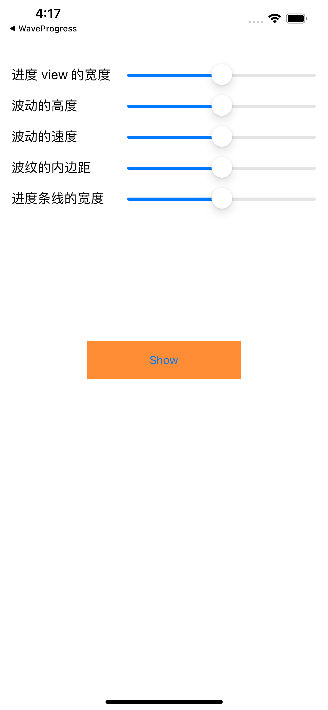
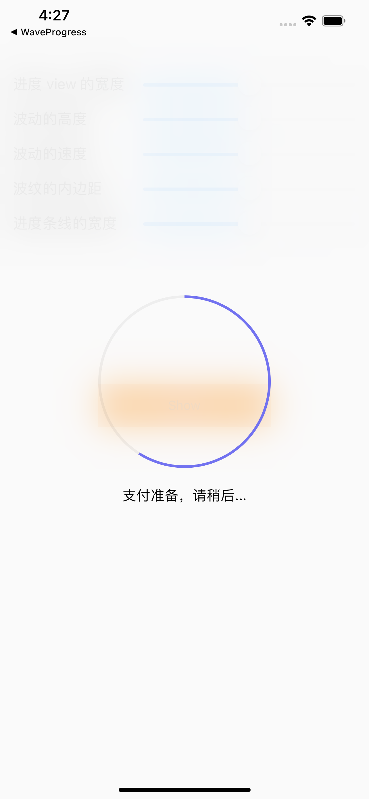
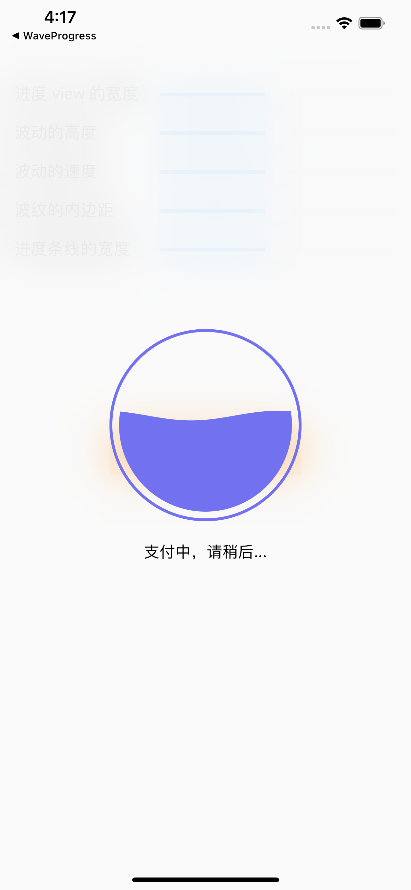
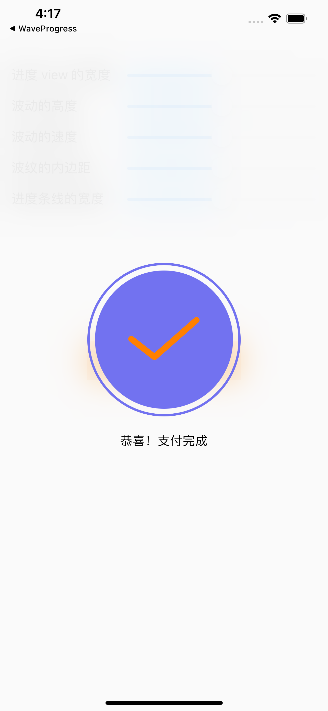
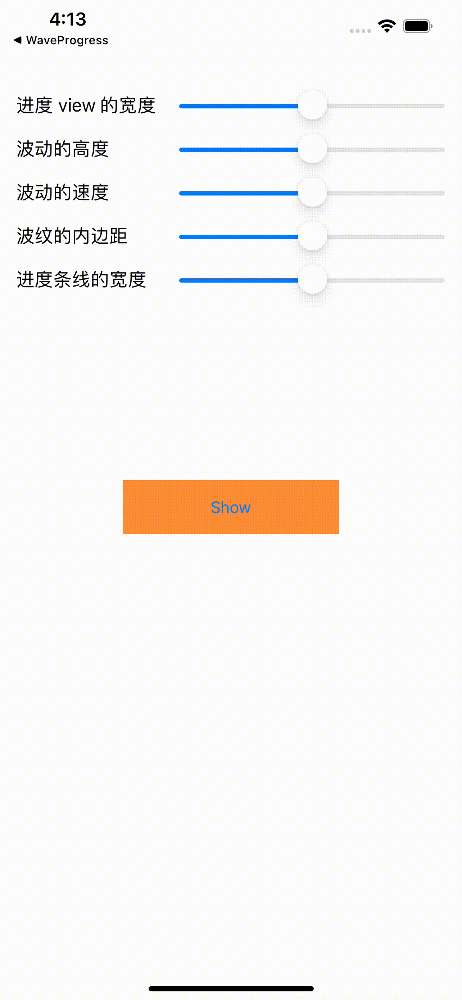

# IAPWaveProgressView

[](https://travis-ci.org/fuyoufang@163.com/IAPWaveProgressView)
[](https://cocoapods.org/pods/IAPWaveProgressView)
[](https://cocoapods.org/pods/IAPWaveProgressView)
[](https://cocoapods.org/pods/IAPWaveProgressView)

内购水波过度动画，分为三个过程，准备支付，支付中（验证中），支付完成，分别有对应的动画展示。

| 调整 | 准备支付 | 支付中 / 验证中 | 支付完成 |  完整动画 |
| :----: | :----: | :----: | :----: | :----: |
|  |  |  |  |  |

## Example

clone 代码后，在运行 demo 前，首先在 Example 目录下运行 `pod install` 命令。
## Requirements

- iOS 9.0 以上
## Installation

通过 pod 使用 IAPWaveProgressView：

```ruby
pod 'IAPWaveProgressView'
```

## Author

fuyoufang@163.com
## License

IAPWaveProgressView is available under the MIT license. See the LICENSE file for more info.
